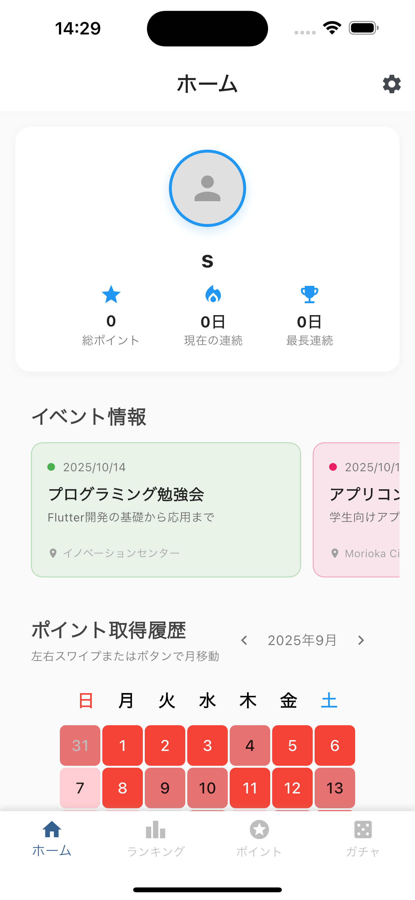
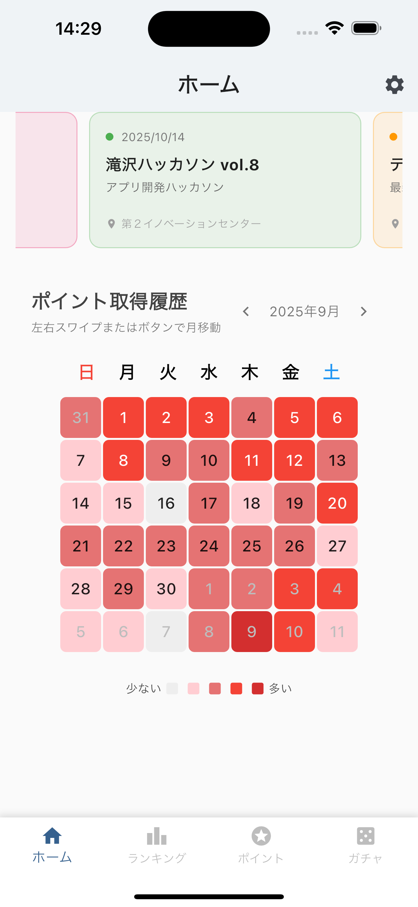
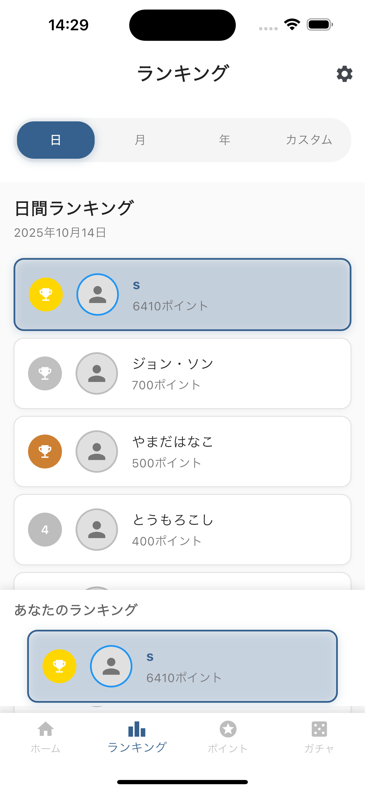
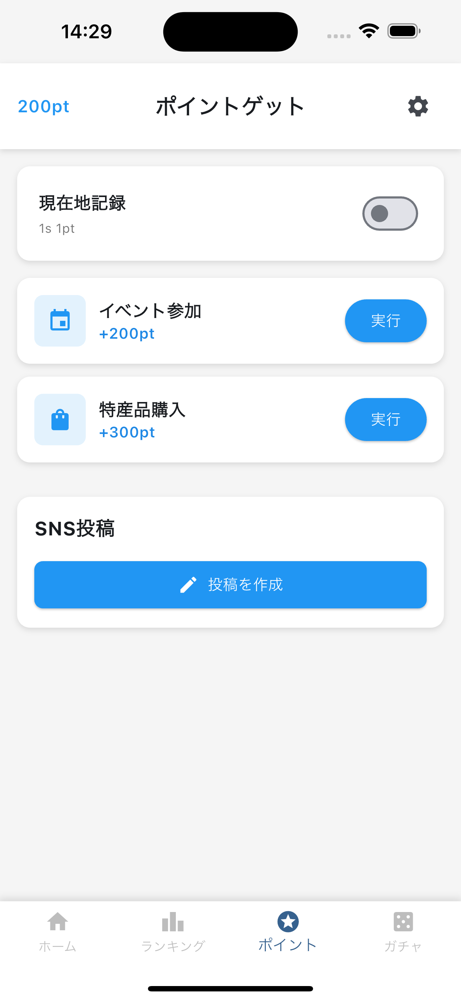
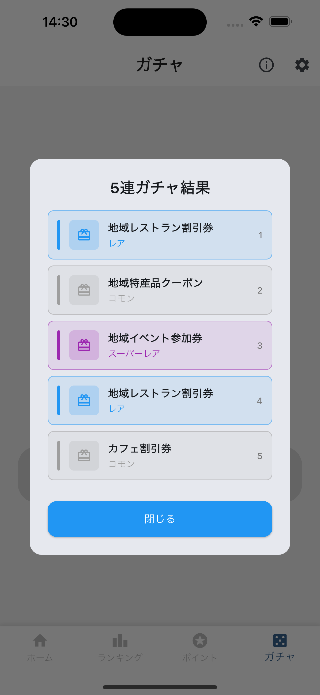

# たきざわこねくと

## アプリケーション画面

  

    
<strong>ホーム画面</strong>

    
  

  

    
<strong>ホーム画面</strong>

    
  

  

    
<strong>ランキング画面</strong>

    
  

  

    
<strong>ポイント画面</strong>

    
  

  

    
<strong>ガチャ画面</strong>

    
  

## 概要
「たきざわこねくと」は、岩手県滝沢市との絆を育み、深める地域密着型アプリです。移住や就職で滝沢市を離れた方々に「また戻りたい」と思ってもらえるよう、故郷とのつながりを維持する機会を提供します。

また、現在の滝沢市民が日常的にポイントを貯めて特典を楽しむことで、アプリへの愛着を育み、将来滝沢市を離れても「あの時の思い出」として心に残る体験をすることが可能です。離れていても故郷との絆を感じ続けるアプリを目指しています。

## 主な機能
- **ポイントを貯める**：滝沢市の特産品を購入したり、イベントに参加したりすることでポイントを貯めます
- **ランキングで競う**：獲得したポイントを日・月・年それぞれのランキングで競うことができます
- **ポイントを使う**：獲得したポイントでガチャを引くことができます。このガチャから取得した食事券やクーポンを滝沢市で使用することを考えています。

## 開発環境
- Flutter 3.32.3
- Dart 3.8.1
- Firebase(Firestore)
- Riverpod(状態管理)

## 今後の展望
- 現在の位置情報をもとにポイントが貯まる仕組みを作る
- Firebaseに問い合わせる時が多いので、キャッシュをうまく利用し、動作を軽くする
- ポイントでご当地キャラの育成など、より愛着が湧くような機能を追加する
- 滝沢の情報がPush通知で届くように、離れている人が使う理由をもっと増やす